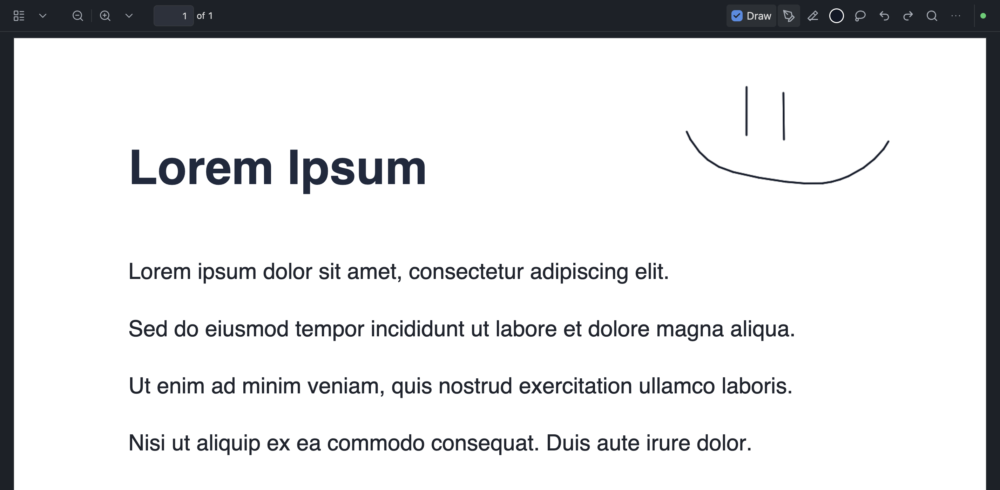

# Welcome to Handwriting Natively!

## What Handwriting Natively Does

Handwrite on PDFs and supported static PNG/JPEG images with a stylus or mouse natively in Obsidian. Annotations live in vault metadata, while explicit page insert/delete/import/scan actions update the open PDF and remap its sidecar atomically. Export PDFs as flattened or editable copies, or export an annotated image as a bounded flattened copy in its source PNG/JPEG format. Text boxes are sidecar-backed and editable in Text mode; physical eraser tips and optional whole-stroke/right-click erasing are supported.

I made this plugin after realizing I use Obsidian a lot more than another nameless note taking app.. I hope you find it as useful as I do!

- Pen, graphite pencil, highlighter, laser pointer, eraser, and lasso tools and a nifty toolbar
- Mainly built for stylus, yet mouse is also available to draw and drag
- Autosaving, everyones favorite feature
- Assignable Hotkeys commands to switch to Pen, Eraser, Laser Pointer, Lasso, or Text , plus undo and redo 

## Setup

### Quick Start

1. Look in Obsidian Plugins
2. Look up Handwriting Natively
3. Install and enjoy in any PDF!

### Manual Setup

1. Download the BRAT plugin
2. Press on its icon to enter a plugin, and paste in https://github.com/MarsLuay/handwriting-natively
3. Select any release you desire! (the latest pre-release is my pick..)
4. Press install and enjoy

### PDF viewer ownership

PDF leaves are opened by the plugin-owned public `ItemView`. The viewer keeps PDF.js for parsing, text, annotation, and raster rendering, while the plugin owns the page shells, scroll/zoom state, and same-DOM handwriting overlays. The pinned PDF.js runtime and worker are packaged under `pdfjs/` at build time; no CDN or Obsidian private viewer DOM is required. If the packaged runtime cannot load, the view fails closed and offers the native Obsidian PDF viewer as a reversible fallback.

## If you want..

If you like what I've made, I would deeply appreciate a donation to my https://buymeacoffee.com/marwanluaye! I need to support a coffee addiction but have to spend my spare money on silly things like a college education

## License

MIT — see [LICENSE](LICENSE).

If this project is used for any others, all that is required is acknowledging this repo and me. Thank you! Build cool things

## Privacy

Local-only annotation processing. See [PRIVACY.md](PRIVACY.md) and [TERMS.md](TERMS.md). No online telemetry or hosted service.
